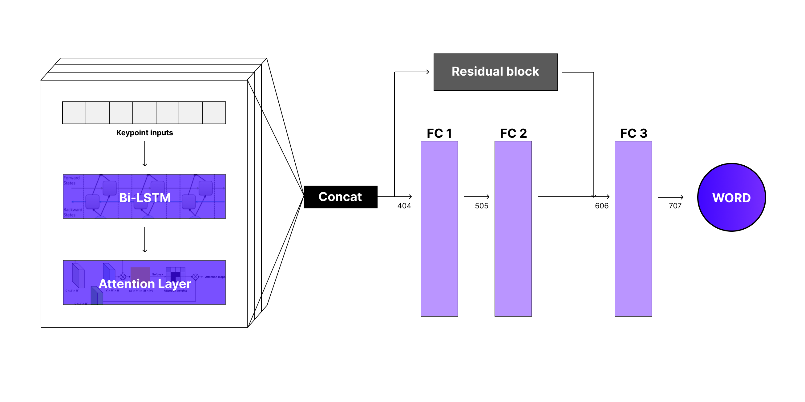

## Hand_Sound_Squad_Modeling

### 사용 데이터  
AI Hub 수어 영상 데이터  
https://aihub.or.kr/aihubdata/data/view.do?currMenu=115&topMenu=100&aihubDataSe=realm&dataSetSn=103  
- Train 1 to 16, Test 17, 18 Data
- Front Data Only

### python 파일 정리
1. translate_coordinate.py : 데이터 전처리(OpenPose가 예측한 Keypoint 입력)(Using before UI)
2. LSTM_Attention_final_model.ipynb : 모델링 성능 고도화
3. LSTM_zero_padding.ipynb : 데이터 전처리 수행 코드

### npy 파일 정리
1. AI_hub_숫자_word_list.npy : 해당 숫자 폴더 morpheme 중 범용성이 높아 실제로 사용할 단어만 정리해둔 npy
2. folder_숫자.npy : 여러 keypoint 값 중에 실제로 사용한 폴더명 npy (natsorted 순)
3. label_숫자.npy : 위에서 사용한 folder의 라벨 값 (위의 폴더 순서와 동일하게 라벨 순서)
4. keypoint_숫자_sequence_by_folder.npy : 위의 정보를 바탕으로 keypoint들을 sequence로 변경
5. normalized_keypoints_숫자_by_folder.npy : 논문처럼 좌측 어깨 72번째 좌표, 우측 75번째 좌표의 평균으로 정규화한 좌표
6. padding_data_숫자_최대시퀀스길이.npy : 도돌이표 패딩을 진행한 npy -> 학습에 사용

### 폴더 정리
1. morpheme : 영상의 시작 위치, label 값을 담은 json
2. keypoints : 영상의 keypoint 좌표를 담은 json
3. label_npy : keypoint 폴더별 사용하는 라벨을 저장
4. use_folder_npy : keypoint 폴더별 사용하는 진짜 폴더 이름 저장
5. keypoint_sequence : keypoint 폴더별 sequence를 저장한 npy
6. normalize_keypoints : keypoint 폴더별 좌표를 정규화한 npy
7. padding_data : keypoint 폴더별 패딩을 진행해서 길이를 맞춰준 npy
